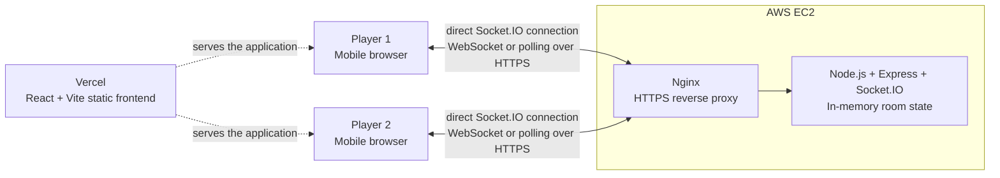

# Velocity Duel

A mobile-first, real-time reaction game where two players use their phones to assemble a toy weapon and compete in a face-to-face speed duel.

[Live Demo](https://velocity-duel.vercel.app/) · [GitHub Repository](https://github.com/Everlincoln/velocity_duel) · [Backend Health Check](https://velocity-api.siqi-liu.com/health)

## Overview

Velocity Duel is a short-session party game designed for two friends or family members playing together in the same physical space. It is not intended to be a global matchmaking platform. Instead, one player creates a room, shares a short code, and both players complete a fast weapon-assembly challenge before racing to fire.

That product scope is deliberate. Reaction games are sensitive to network latency, and matching distant players can make results feel less fair. Velocity Duel therefore prioritises quick entry, a low learning curve, clear feedback, and a face-to-face experience that can be understood within seconds.

Recent development has shifted from adding more screens and mechanics toward simplifying onboarding, improving interaction responsiveness, strengthening cross-device behaviour, and polishing the complete round flow.

## Problem and Solution

| | Description |
| --- | --- |
| **Problem** | Casual multiplayer games can lose players when onboarding is complicated, while network latency can undermine fairness in reaction-based gameplay. |
| **Solution** | Velocity Duel provides a lightweight room-based flow in which two players join from separate phones, prepare motion controls, assemble their weapons, and complete a synchronised reaction duel in real time. |

## Core Game Flow

1. A player enters an optional nickname and selects **PLAY!** to create a room.
2. The second player enters the room code from another device.
3. Both players appear in the Ready Room and enable motion controls where required.
4. When both players are ready, the weapon assets are prepared and both clients enter the assembly phase.
5. Each player drags the magazine and slide into calibrated snap targets on the weapon canvas.
6. The completed weapon transitions directly to the firing phase.
7. The first detected shake triggers a client fire event; desktop development can use the Space key as a fallback.
8. The server accepts the first received `playerFired` event, resolves the duel, and broadcasts the result to both players.

## Key Features

- Short-code room creation and room-code validation
- Optional custom nicknames with playful generated fallbacks
- A strict maximum of two socket-connected players per room
- Real-time join, leave, disconnect, and room-state updates
- Server-synchronised ready states and a coordinated match transition after both players are ready
- Mobile motion-permission gating inside the Ready Room
- Touch-friendly weapon assembly with forgiving logical-coordinate snap zones
- A versioned, configuration-driven weapon layout shared by editor and gameplay
- DeviceMotion-based shake detection with a desktop Space-key fallback
- Client-measured firing time with server-coordinated first-fire resolution
- Synchronised winner and loser results, replay, and leave-room flows
- Pooled HTML audio for assembly feedback and a firing sound
- Weapon-image preloading before multiplayer gameplay begins
- Landscape-first mobile UI with safe-area handling and a portrait rotate prompt
- Socket connection progress, timeout handling, visible errors, and development diagnostics
- WebSocket and HTTP long-polling transport support through Socket.IO

## Technical Highlights

### Real-Time Multiplayer

The multiplayer backend is a small Node.js service built with Express and Socket.IO. Rooms are held in an in-memory `Map`, with each room tracking up to two players, readiness, reaction time, and whether the round has already been resolved.

The client waits for an actual Socket.IO connection before emitting room actions, rather than assuming that `socket.connect()` completes synchronously. It also reports connection progress and failures without silently entering a simulated multiplayer room. Socket.IO is configured to use WebSocket or fall back to polling when necessary.

The server owns the multiplayer room state and validates room membership by socket ID. It coordinates room creation, joining, readiness, firing, match resolution, leaving, and disconnect cleanup. Firing time is measured by the client with `performance.now()` and submitted as `reactionTimeMs`; the first received `playerFired` event resolves the round, and the room's resolved state prevents later firing events from resolving it again. The server does not validate DeviceMotion sensor data or independently verify the client-provided reaction time.

Because storage is currently in memory, room state is reset whenever the backend process restarts. There is no database, Redis layer, or persistent session store in the current implementation.

### Configuration-Driven Weapon Assembly

Early layout calibration used `localStorage`, which could produce different results across browsers or deployment environments. The production source of truth is now the version-controlled [`pistol-layout.json`](src/data/weapons/pistol-layout.json) file.

The assembly system uses:

- A fixed `1600 x 900` logical coordinate space
- `WeaponCanvas` as the shared rendering component
- `weaponCanvasConfig` for part definitions and layout resolution
- Versioned JSON values for each part's position, scale, rotation, and z-index
- Logical pointer-coordinate conversion so snap calculations remain stable at different rendered sizes

A development-only Weapon Layout Editor provides drag, scale, rotation, numeric position controls, keyboard nudging, ghost/debug modes, and serialised layout output. Production gameplay reads the committed JSON configuration; `localStorage` is accepted only as a matching-version override during development.

### DeviceMotion and HTTPS

Shake-to-fire uses the browser `DeviceMotionEvent` API. On mobile browsers that expose `requestPermission()`, permission is requested directly from a player gesture in the Ready Room. A player is not marked ready when required motion access is denied.

Sensor access depends on browser support and a secure HTTPS context. The application handles granted, denied, and unavailable states, but it does not assume that every device or browser exposes the same motion-permission API. Desktop testing remains possible with the Space key.

### UX and Runtime Performance

The interface is designed as a landscape game scene rather than a scrolling website. It uses dynamic viewport units, safe-area insets, a portrait orientation prompt, compact Ready Room states, touch input, and responsive scaling while preserving the weapon's logical coordinates.

The current implementation also includes several runtime-focused decisions:

- Weapon images are decoded before the multiplayer match begins.
- Drag visuals are batched through `requestAnimationFrame` and transient positions are held in refs to avoid a full React update for every raw pointer event.
- Canvas bounds are cached during a drag to reduce repeated layout measurement.
- Short assembly sounds use four pre-created `HTMLAudioElement` instances per sound so rapid feedback does not repeatedly interrupt one audio element.
- Audio is prepared from existing user interactions and playback errors do not block gameplay.

## Architecture



Vercel serves the static React application to each browser. It does not relay multiplayer messages between players. Once loaded, each browser connects directly to the Socket.IO backend through the HTTPS Nginx endpoint.

## Technology Stack

| Area | Technology | Use in Velocity Duel |
| --- | --- | --- |
| Frontend | React 19, TypeScript | Page flow, room state, interactions, and game UI |
| Build tooling | Vite 8 | Local development and production bundling |
| Styling | Custom CSS | Responsive landscape layouts, safe areas, animation, and visual effects |
| Real-time client | Socket.IO Client | Room events, connection state, and multiplayer synchronization |
| Backend | Node.js, Express | HTTP server and `/health` endpoint |
| Real-time server | Socket.IO | Two-player rooms and event-driven duel state |
| Server configuration | CORS, dotenv | Allowed client origins, port, and environment configuration |
| Browser APIs | DeviceMotion API | Shake-to-fire input and mobile permission flow |
| Browser APIs | HTML Audio | Preloaded sound pools and gameplay audio feedback |
| Browser storage | `localStorage` | Development-only weapon-layout override and calibration workflow |
| Deployment | Vercel | React/Vite frontend hosting |
| Deployment | AWS EC2, Nginx, HTTPS | Socket.IO backend hosting and reverse proxy |

## Real-Time Event Flow

| Event | Direction | Purpose |
| --- | --- | --- |
| `createRoom` | Client → Server | Creates a room and assigns its creator to Player 1. |
| `roomCreated` | Server → Creator | Confirms the created room and player number. |
| `joinRoom` | Client → Server | Validates a code and adds the second player when capacity allows. |
| `playerJoined` | Server → Room | Announces the updated room after a player joins. |
| `roomUpdated` | Server → Room | Synchronises the current player list, readiness, nicknames, and reaction values. |
| `playerReady` | Client → Server | Updates the sending socket's ready state. |
| `bothPlayersReady` | Server → Room | Initiates the coordinated gameplay transition after two distinct players are ready. |
| `playerFired` | Client → Server | Submits the firing player's measured reaction time. |
| `playerFired` | Server → Room | Announces the accepted first shot and updated room state. |
| `gameResult` | Server → Room | Broadcasts the winner, loser, and winning reaction time. |
| `leaveRoom` | Client → Server | Explicitly removes the current socket from its room. |
| `playerLeft` | Server → Room | Notifies the remaining player after a leave or disconnect. |
| `disconnect` | Socket lifecycle → Server | Triggers room cleanup when a client connection closes. |

## Repository Structure

```text
velocity_duel/
├── public/
│   └── sounds/                 # Assembly and firing audio
├── server/
│   ├── index.js                # Express, Socket.IO, rooms, and game results
│   └── .env.example            # Backend environment variables
├── src/
│   ├── assets/                 # Character and weapon artwork
│   ├── components/
│   │   ├── WeaponCanvas.tsx    # Shared logical weapon renderer
│   │   └── weaponCanvasConfig.ts
│   ├── data/weapons/
│   │   └── pistol-layout.json  # Production weapon calibration
│   ├── lib/
│   │   ├── gameAudio.ts        # Audio preparation, pooling, and playback
│   │   └── socket.ts           # Socket.IO client configuration
│   ├── pages/                  # Home, room, assembly, fire, result, and dev editor
│   └── App.tsx                 # Application state and multiplayer event orchestration
├── .env.example
└── package.json
```

## Local Development

The frontend and backend run as separate processes, so use two terminal windows.

### 1. Clone the repository

```bash
git clone https://github.com/Everlincoln/velocity_duel.git
cd velocity_duel
```

### 2. Start the backend

```bash
cd server
npm install
cp .env.example .env
npm run dev
```

The backend environment should contain:

```env
PORT=3001
CLIENT_ORIGIN=http://localhost:5173
```

Verify it at [http://localhost:3001/health](http://localhost:3001/health). A healthy server returns:

```json
{ "ok": true }
```

### 3. Start the frontend

From a second terminal at the repository root:

```bash
npm install
cp .env.example .env
npm run dev
```

The frontend environment should contain:

```env
VITE_SOCKET_SERVER_URL=http://localhost:3001
```

Open the local URL printed by Vite. Two desktop browser windows can test the Socket.IO room flow locally using the localhost configuration above.

Testing with physical phones requires Vite to listen on all network interfaces so other devices on the LAN can reach it:

```bash
npm run dev -- --host 0.0.0.0
```

Use LAN-accessible frontend and backend addresses rather than `localhost`. Replace `localhost` in `CLIENT_ORIGIN` and `VITE_SOCKET_SERVER_URL` with the development computer's LAN IP address, including the appropriate frontend and backend ports. For reliable DeviceMotion access, use the HTTPS production deployment or a trusted HTTPS tunnel, because mobile sensor APIs may require a secure context.

### Available Scripts

| Location | Command | Purpose |
| --- | --- | --- |
| Repository root | `npm run dev` | Start the Vite development server. |
| Repository root | `npm run build` | Type-check and create a production frontend build. |
| Repository root | `npm run lint` | Run ESLint across the project. |
| Repository root | `npm run preview` | Preview the production frontend build locally. |
| `server/` | `npm run dev` | Start the backend with Node's watch mode. |
| `server/` | `npm start` | Start the backend with `node index.js`. |

## Production Deployment

The current production topology is:

- The React/Vite frontend is deployed to Vercel.
- `VITE_SOCKET_SERVER_URL` points the browser application to the production Socket.IO endpoint.
- The Node.js, Express, and Socket.IO backend runs on AWS EC2.
- Nginx terminates HTTPS and proxies traffic to the Node.js process.
- `CLIENT_ORIGIN` configures the backend's accepted frontend origin or comma-separated origins.
- `PORT` configures the backend listener and falls back to `3001` when unset.
- `GET /health` provides a lightweight deployment health check.

No AWS Lambda, API Gateway, Docker, Kubernetes, Redis, or database layer is used by the current repository.

## Project Status

**Core gameplay and multiplayer flow are complete. The project is now in the polishing and iterative improvement stage.**

Current and future improvement areas include:

- Broader testing on real mobile devices and browser versions
- Further interaction and runtime performance refinement
- Accessibility improvements for controls, status, and reduced-motion preferences
- Additional gameplay balancing and feedback tuning
- More robust reconnect and interrupted-session recovery
- Automated unit, integration, and end-to-end testing

These items describe planned work rather than completed functionality.

## Engineering Lessons

- Simplifying a product can require more careful engineering than adding another feature.
- Runtime state and competing configuration sources can create subtle cross-browser and deployment inconsistencies.
- Secure contexts and user gestures directly affect access to browser sensor and audio APIs.
- Real-time state synchronisation needs explicit handling for identity, joins, readiness, firing, leaving, and unexpected disconnects.
- Reaction-based product decisions should prioritise clarity, responsiveness, and perceived fairness over feature quantity.

## Screenshots

A dedicated documentation screenshot set is not currently committed to the repository. A future `docs/images/` gallery can document the Home, Ready Room, Weapon Assembly, Fire, and Result screens without relying on external image URLs.

## Author

**Yajing Song**  
Software Engineer  
[GitHub](https://github.com/Everlincoln)
